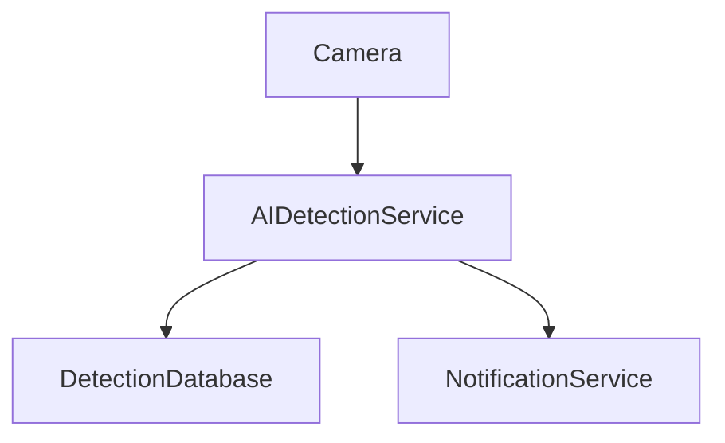

# Service Boundary của nhóm

## 1. Thông tin nhóm

- Tên nhóm: 14 
- Lớp: CNTT 17-09
- Thành viên: Bùi Anh Đức ,Trịnh Minh Quân, Nguyễn Nhật Quang , Lê Cao Tất Thành
- Service nhóm phụ trách: AI
- Sản phẩm tổng thể của lớp:

## 2. Actor

Ai tương tác với hệ thống/service?

## 3. System Boundary

Nhóm em xây phần nào?

Phần nhóm kiểm soát:

- Nhận ảnh hoặc video frame từ camera/hệ thống khác
- Phân tích dữ liệu bằng mô hình AI
- Phát hiện đối tượng như người, xe, vật thể nguy hiểm,...
- Tính độ chính xác (confidence)
- Đánh giá mức độ rủi ro (risk level)
- Trả kết quả dưới dạng JSON qua API
- Ghi log và kiểm tra trạng thái hoạt động của service

Phần nhóm chỉ tích hợp:

- ...

## 4. Service Boundary

Service của nhóm có trách nhiệm gì?

Service KHÔNG làm gì?
- Quản lý tài khoản người dùng
- Xác thực đăng nhập
- Hiển thị giao diện web/mobile
- Điều khiển camera vật lý
- Gửi email hoặc SMS trực tiếp
- Lưu trữ video dài hạn
- Quản lý phân quyền hệ thống
- Xử lý nghiệp vụ của các service khác

## 5. Input / Output

### Input

- Service nhận dữ liệu ảnh hoặc video frame từ camera/hệ thống khác.

Ví dụ request:

```json
{
  "camera_id": "cam-01",
  "image_url": "https://example.com/image.jpg",
  "timestamp": "2026-05-11T10:00:00Z"
}
```

### Output

```json
{
  "detected": true,
  "label": "person",
  "confidence": 0.95,
  "risk_level": "medium"
}
```

## 6. API dự kiến

| Method | Endpoint | Mục đích |
| --- | --- | --- |
| GET | /health | Kiểm tra service |
| POST | /detect | Nhận ảnh và thực hiện detection |
| GET | /detections | Lấy danh sách detection |
| GET | /detections/{id} | Xem chi tiết detection |
| POST | /analyze-risk | Phân tích mức độ rủi ro |

## 7. Phụ thuộc service khác

### Service này gọi đến service nào?

- AI Model Service
- Detection Database
- Notification Service
- Monitoring Service

### Service nào gọi đến service này?

- Camera Service
- API Gateway
- Dashboard Frontend
- Mobile Application

## 8. Sơ đồ minh họa


